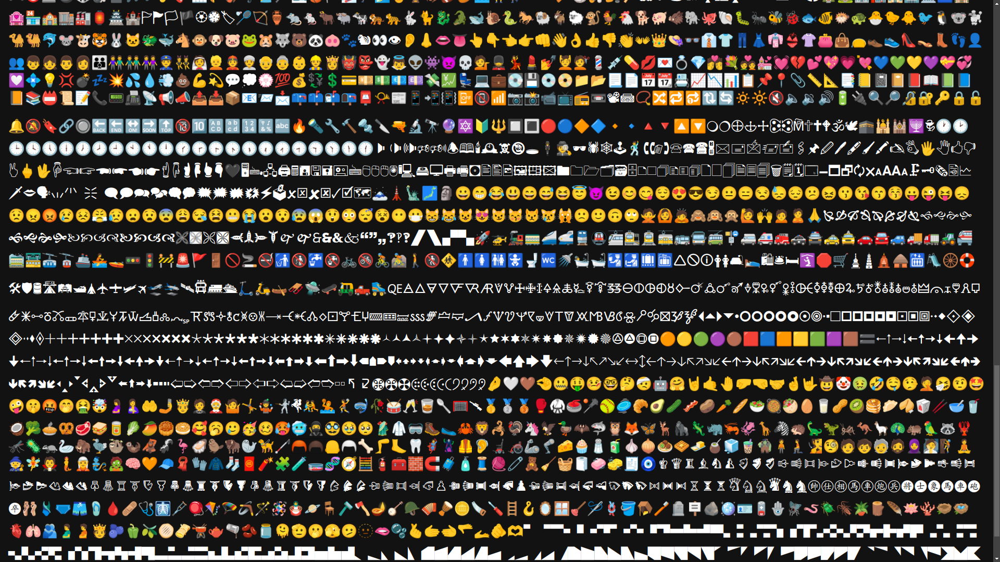

# unicode_palette



Unicode is now almost ubiquitous, and it has a very rich set of symbols and emojis that one can use to visually improve their communication.

The question is how to find and use them.

This program generates a data: URL containing a palette of Unicode symbols that can be copied from and searched (if the name is included).

This URL can then be opened in your browser and/or bookmarked in order to always have a visual reference handy.

## Installation

* Install [pipx](https://pipx.pypa.io/stable/installation/)

```sh
pipx install git+https://github.com/deedf/unicode_palette
```

## Usage

```sh
usage: unicode_palette [-h] [--add-name | --no-add-name] [--add-hover | --no-add-hover] [--html | --no-html] [--base64 | --no-base64]
                       [--category [CATEGORY ...]] [--name-font-size NAME_FONT_SIZE] [--font-family FONT_FAMILY]

Generate data: URL with Unicode symbol palette.

options:
  -h, --help            show this help message and exit
  --add-name, --no-add-name
                        Add character name
  --add-hover, --no-add-hover
                        Add character name as hover
  --html, --no-html     HTML format
  --base64, --no-base64
                        base64 encoding
  --category [CATEGORY ...]
                        Unicode categories to dump
  --name-font-size NAME_FONT_SIZE
                        Font size for character name in HTML
  --font-family FONT_FAMILY
                        Font family to use in HTML
```
